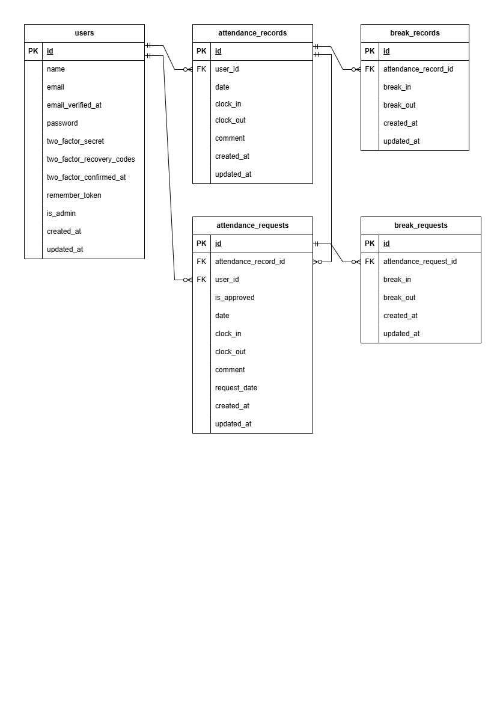

# attendance-app

## プロジェクト名

COACHTECH 勤怠管理アプリ

## 概要

COACHTECHの模擬案件テストとして作成した成果物です。

- 勤怠管理画面から出勤・退勤・休憩入・休憩戻を行えます。
- ユーザーは勤怠の修正を行い、承認依頼を出せます。
- 過去6カ月の勤怠状況を集計できます。
- 管理者は全ユーザーの勤怠の確認と、各ユーザーの勤怠申請の承認を行えます。

## ER図



## 環境構築手順

### 1. プロジェクトの配置場所へ移動

フォルダを作成して移動します。

```bash
mkdir laravel-practice
cd laravel-practice
```

### 2. リポジトリのクローン

```bash
git clone https://github.com/Hayashi-0506/attendance-app.git attendance-app
cd attendance-app
```

### 3. パッケージのインストール

```bash
docker run --rm \
    -u "$(id -u):$(id -g)" \
    -v "$(pwd):/var/www/html" \
    -w /var/www/html \
    -e COMPOSER_CACHE_DIR=/tmp/composer_cache \
    laravelsail/php82-composer:latest \
    composer install
```

### 4. 環境設定ファイルの作成

```bash
cp .env.example .env
```

### 5. Laravel Sailのインストール

Laravel Sailをインストールします。

```bash
docker run --rm \
    -u "$(id -u):$(id -g)" \
    -v "$(pwd):/var/www/html" \
    -w /var/www/html \
    -e COMPOSER_CACHE_DIR=/tmp/composer_cache \
    laravelsail/php82-composer:latest \
    composer require laravel/sail --dev
```

Sailの設定ファイルをパブリッシュします（MySQLを選択）。

```bash
docker run --rm \
    -u "$(id -u):$(id -g)" \
    -v "$(pwd):/var/www/html" \
    -w /var/www/html \
    -e COMPOSER_CACHE_DIR=/tmp/composer_cache \
    laravelsail/php82-composer:latest \
    php artisan sail:install --with=mysql
```

> **※ M1/M2/M3 Mac（Apple Silicon）をお使いの方**
>
> Apple Silicon搭載のMacでは、`sail up -d` 実行時に以下のエラーが発生することがあります。
>
> ```text
> no matching manifest for linux/arm64/v8
> ```
>
> 解決方法：`compose.yaml` を開き、mysqlサービスに `platform: 'linux/amd64'` を追加してください。
>
> ```yaml
> mysql:
>     image: 'mysql/mysql-server:8.0'
>     platform: 'linux/amd64'  # ← この行を追加
>     ports:
> ```

### 6. .env ファイルの設定

`.env` ファイルを開き、データベース接続情報とメール設定が以下と一致していることを確認します。

```env
DB_CONNECTION=mysql
DB_HOST=mysql
DB_PORT=3306
DB_DATABASE=laravel
DB_USERNAME=sail
DB_PASSWORD=password

MAIL_MAILER=smtp
MAIL_HOST=mailpit
MAIL_PORT=1025
```

### 7. Sailの起動とエイリアス設定

Sailをバックグラウンドで起動します。

```bash
./vendor/bin/sail up -d
```

エイリアスを設定して、`sail` だけでコマンドを実行できるようにします。

zsh の場合：

```bash
echo "alias sail='[ -f sail ] && bash sail || bash vendor/bin/sail'" >> ~/.zshrc
```

bash の場合：

```bash
echo "alias sail='[ -f sail ] && bash sail || bash vendor/bin/sail'" >> ~/.bashrc
```

シェルを再起動するか、新しいターミナルを開いてエイリアスを有効にします。

```bash
exec $SHELL
```

### 8. フロントエンドのセットアップ（Vite & Tailwind CSS）

本プロジェクトでは、フロントエンドのスタイリングにTailwind CSSを使用します。

#### 8-1. NPM依存パッケージのインストール

> **重要：** `sail npm install` を実行する前に、必ずSailコンテナが起動していることを確認してください。

```bash
sail npm install
```

#### 8-2. Tailwind CSS / Alpine.js のインストール

```bash
sail npm install -D tailwindcss@^3.4.0 postcss autoprefixer
sail npm install alpinejs
```

#### 8-3. Vite開発サーバーの起動

```bash
sail npm run dev
```

> **注意：** `sail npm run dev` は実行したままにしておく必要があります。以降のコマンドは別のターミナルで実行してください。

### 9. アプリケーションキーの生成

プロジェクトのルートで以下のコマンドを実行します。

```bash
sail artisan key:generate
```

### 10. データベースのマイグレーションと初期データ投入

以下のコマンドでテーブルを作成し、初期データを投入します。

```bash
sail artisan migrate --seed
```

既存のデータベースをリセットしたい場合は、以下を実行してください。

```bash
sail artisan migrate:fresh --seed
```

## 使用技術

| 項目 | 内容 |
| --- | --- |
| 言語 | PHP 8.5.7 |
| フレームワーク | Laravel 10.x + Sail |
| DB | MySQL 8.0 |
| Webサーバー | Nginx |
| フロントエンド | Vite, Tailwind CSS ^3.4.0 |
| 開発ツール | Docker, Laravel Sail, phpMyAdmin |

## APIエンドポイント一覧

- http://localhost/api/v1/attendance-records

## 開発環境URL

| 画面 | URL |
| --- | --- |
| ログイン画面 | http://localhost/login |
| 管理者用ログイン画面 | http://localhost/admin/login |

## 開発者

林 佑一
